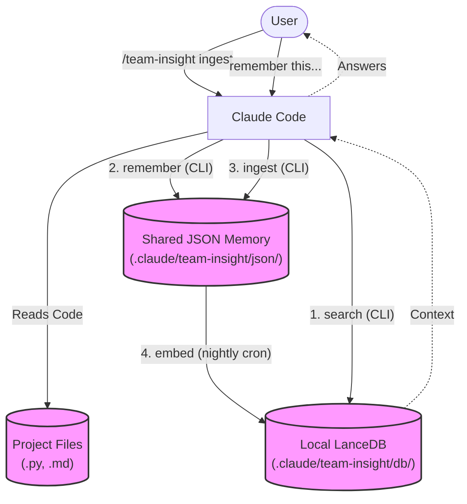

# Team-Insight: Shared Memory for Claude Code

A skill-driven shared memory system for Claude Code that enables multi-user, project-level knowledge persistence using LanceDB.

## Architecture

```
.claude/skills/team-insight/     ← Skill (code + instructions)
├── SKILL.md                     ← Main entry point
├── module_*.md                  ← Per-capability instructions
├── setting.json                 ← Configuration (API keys, models)
├── env/team-insight-avx.sif     ← Self-contained Python environment
├── scripts/*.py                 ← Core Python scripts
└── references/*.md              ← File-type parsing guides

.claude/team-insight/            ← Data
├── json/user/{username}/        ← Conversation memories
├── json/file/                   ← Ingested file memories
└── db/                          ← LanceDB vector database
```

## How It Works (The Workflow)

Team-Insight operates on a simple 2-step lifecycle: **Generate JSON** -> **Embed JSON**. 
Because the JSON files act as an intermediate state, they can be safely committed to Git and shared seamlessly with your team without causing binary database conflicts.



### The 4 Core Modules

1. **Search**: Claude queries your local LanceDB when it lacks context.
2. **Remember**: Claude extracts facts/decisions from your conversation and saves them as `.json` files.
3. **Ingest**: Claude reads raw project files and digests them into semantic `.json` summaries.
4. **Embed**: A Python script reads all `.json` files and syncs them into the local LanceDB for lightning-fast retrieval.

## Advanced Memory Retrieval

Team-Insight implements a highly optimized **Hybrid Search Pipeline** to ensure Claude Code always retrieves the most relevant context, minimizing hallucinations and token waste:

1. **Hybrid Search (Vector + BM25 keyword)**: It doesn't just rely on semantic embeddings. It simultaneously performs a BM25 exact-keyword search. Results found in *both* are boosted via **Reciprocal Rank Fusion (RRF)**.
2. **Length Normalization**: Very long text chunks are slightly penalized to prevent them from dominating the search results.
3. **Time Decay factor**: Older memories gradually decay in relevance compared to newer insights, ensuring Claude prioritizes the latest codebase decisions. 
4. **Maximal Marginal Relevance (MMR)**: Before returning results to Claude, it uses MMR to brutally filter out near-duplicate chunks, ensuring maximum *diversity* in the provided context window.
5. **Metadata Filtering**: Searches can be strictly filtered by `file_type` (e.g., only Python files) or by `author`, making targeted queries extremely precise.

## Setup

### 1. Build the SIF container

```bash
cd .claude/skills/team-insight/env
apptainer build team-insight-avx.sif team-insight.def
```

### 2. Configure API keys

Edit `setting.json` and set your embedding provider:

```json
{
  "embedding": {
    "provider": "openai",
    "model": "text-embedding-3-small",
    "api_keys": ["$EMBEDDING_API_KEY"]
  }
}
```

Supported providers: `openai`, `gemini`, `cohere`, `voyage`, `openai-compatible`.

Or just set the environment variable: `export EMBEDDING_API_KEY=sk-...`

### 3. Use with Claude Code

The SKILL.md enables Claude Code to automatically:
- **Search** memory when lacking context
- **Remember** insights from conversations
- **Ingest** project files into memory
- **Embed** JSON files into LanceDB

## CLI Commands

```bash
SIF=.claude/skills/team-insight/env/team-insight-avx.sif
CLI=.claude/skills/team-insight/scripts/cli.py
SET=.claude/skills/team-insight/setting.json

# Search
apptainer exec $SIF python $CLI --setting $SET search "query" --limit 5

# Remember
apptainer exec $SIF python $CLI --setting $SET remember "JWT tokens are stored in HTTP-only cookies" --category decision

# Embed all JSONs into LanceDB
## Headless Automation (Nightly Builds)

You can automate both file ingestion and vector embedding, making it perfect for CI/CD pipelines or nightly cron jobs.

### 1. File Ingestion (Requires Claude Code)

Converting raw project files (`.py`, `.md`, `.pptx`, etc.) into semantic JSON memories requires Claude Code to read and summarize the content. Run Claude Code non-interactively using the `-p` flag. For full automation without prompts, you will need to skip permissions:

```bash
# Headlessly ingest a specific file or folder (DANGEROUS: skipping permissions)
# Claude is instructed strictly via the SKILL to NEVER modify your project files during this process.
claude -p "/team-insight ingest path/to/folder/" --dangerously-skip-permissions
```

### 2. Vector Embedding (Standalone Python)

Embedding the generated JSONs into LanceDB does not depend on Claude Code and can be run entirely standalone. This is highly recommended for a nightly server cron job:

**Example Cron Job (Nightly at 2:00 AM)**:
```bash
0 2 * * * apptainer exec --bind /project:/project /path/to/team-insight-avx.sif python /path/to/cli.py --setting /path/to/setting.json --project-root /project ingest 2>&1 >> /var/log/team-insight.log
```

## Multi-User Workflow

1. All team members share the `.claude/team-insight/json/` directory (via Git)
2. Each member (or a CI/cron job) runs `ingest` to build their local LanceDB
3. Claude Code searches the entire team's collective knowledge

## Credits

This project was inspired by and builds upon the concepts from [memory-lancedb-pro](https://github.com/win4r/memory-lancedb-pro).
